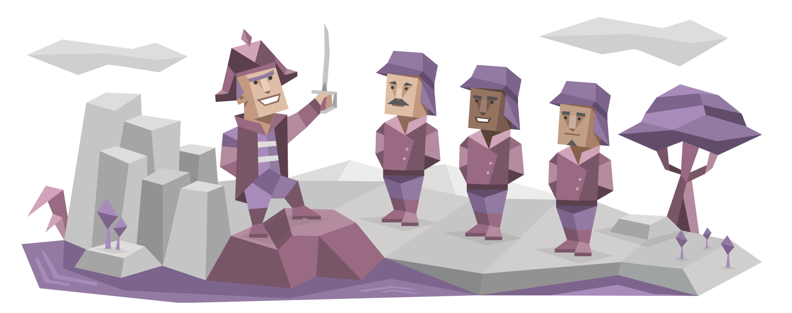

# 🔰 Giriş

> Zamanınız sınırlıdır, bu yüzden başka birinin hayatını yaşayarak harcamayın. \~ Steve Jobs

Komutanlar doğuştan liderdir. Bu kişilik tipine sahip insanlar, karizma ve özgüven yetenekleriyle liderlik yeteneğini sergiler ve ortak bir hedef etrafında kalabalıkları bir araya getiren bir otorite sergilerler. Ancak, Komutanlar aynı zamanda acımasız bir rasyonellik düzeyiyle karakterize edilir ve kendilerine belirledikleri her türlü hedefe ulaşmak için güçlü bir azim, kararlılık ve keskin zekalarını kullanırlar. Belki de dünya nüfusunun sadece yüzde üçünü oluşturuyor olmaları iyidir, aksi takdirde dünyanın geri kalanının büyük bir kısmını oluşturan daha ürkek ve duyarlı kişilik türlerini ezmeleri muhtemeldir – ama günlük yaşamda çoğu zaman önemsemediğimiz birçok iş ve kurumun var olmasını Komutanlara borçluyuz.

## Büyüklük İçin Çaba

Eğer Komutanların sevdiği bir şey varsa, o da büyük ya da küçük, iyi bir zorluktur ve yeterli zaman ve kaynakla, her hedefe ulaşabileceklerine kesinlikle inanırlar. Bu özellik, Komutan kişilik tipine sahip insanları parlak girişimciler yapar ve stratejik düşünme yetenekleri, planlarının her adımını kararlılık ve hassasiyetle uygularken uzun vadeli bir odak sağlar ve onları güçlü iş liderleri yapar. Bu kararlılık, çoğu zaman kendini gerçekleştiren bir kehanet olup, diğerlerinin pes edip devam etme eğiliminde olduğu yerde, Komutanlar hedeflerini sırf irade gücüyle başarıya ulaştırır ve Dışadönük (E) doğaları, süreçte muhteşem sonuçlar elde ederek herkesi de yanlarında sürüklemelerine neden olur.

Pazarlık masasında, kurumsal bir ortamda veya bir araba satın alırken, Komutanlar egemen, amansız ve affetmezdir. Bu, onların kalpsiz veya acımasız oldukları için değil – daha çok, Komutan kişilikli insanlar gerçekten bu ortamdan, zekaların savaşından ve zeka müsabakasından zevk alırlar ve eğer diğer taraf ayak uyduramıyorsa, bu Komutanların kendi zafer ilkesinden vazgeçmeleri için bir neden değildir.

<figure><figcaption></figcaption></figure>

> Komutan zihninden geçen temel düşünce, "duygusuz bir pislik olarak adlandırırsanız umurumda değil, yeter ki etkili bir pislik olarak kalmaya devam edeyim" gibi bir şey olabilir.

Eğer Komutanların saygı duyduğu biri varsa, o da onlara entelektüel olarak karşı koyabilen ve kendi hassasiyet ve kalitesiyle eşit hareket edebilen biridir. Komutan kişilikleri, başkalarının yeteneklerini tanıma konusunda özel bir beceriye sahiptir ve bu, hem ekip kurma çabalarında (çünkü ne kadar zeki olursa olsun, hiç kimse her şeyi tek başına yapamaz) hem de Komutanların çok fazla kibir ve küçümseme sergilememelerine yardımcı olur. Ancak, başkalarının başarısızlıklarını duyarlılık derecesi düşük bir şekilde eleştirme konusunda özel bir yetenekleri vardır ve işte Komutanların gerçekten başı belaya girer.

## Değerli Bir Mücadele

Duygusal ifade, hiçbir Analist türünün güçlü yanı değildir, ancak Komutanların duygularından uzaklık özellikle açıktır ve çok daha geniş bir kesimin doğrudan hissettiği bir şeydir. Özellikle profesyonel bir ortamda, Komutanlar etkisiz, yeteneksiz veya tembel olarak gördükleri kişilerin hassasiyetlerini ezerler. Komutan kişilik tipine sahip insanlar için duygusal gösteriler zayıflık gösterisidir ve bu yaklaşımla düşman kazanmak kolaydır - Komutanların, sadece hedeflerine ulaşmak için değil, aynı zamanda doğrulama ve geri bildirim için de işleyen bir ekibe kesinlikle ihtiyaç duyduklarını hatırlamaları iyi olur; çünkü Komutanlar, ilginç bir şekilde, buna çok duyarlıdır.

Komutanlar gerçek güç merkezleridir ve yaşamlarından daha büyük bir imaj yaratma eğilimindedirler - ve çoğu zaman öylelerdir. Ancak, statülerinin sadece kendi eylemlerinden değil, onları destekleyen ekibin eylemlerinden de geldiğini ve destek ağının katkılarını, yeteneklerini ve ihtiyaçlarını, özellikle duygusal açıdan, tanımak ve takdir etmenin önemli olduğunu hatırlamaları gerekir. "Yapana kadar sahte davran" zihniyeti benimseseler bile, Komutanlar, duygusal açıdan sağlıklı bir odaklanmayı güçlü yönleriyle birleştirirlerse, derin, tatmin edici ilişkiler ve başa çıkabilecekleri kadar zorlu zaferlerle ödüllendirileceklerdir.


